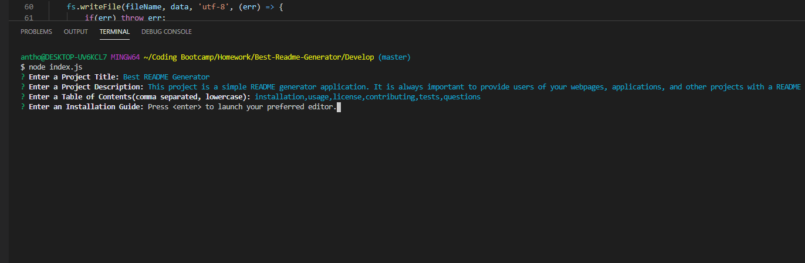
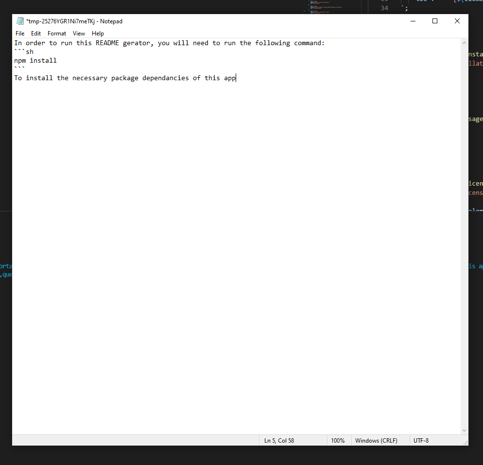
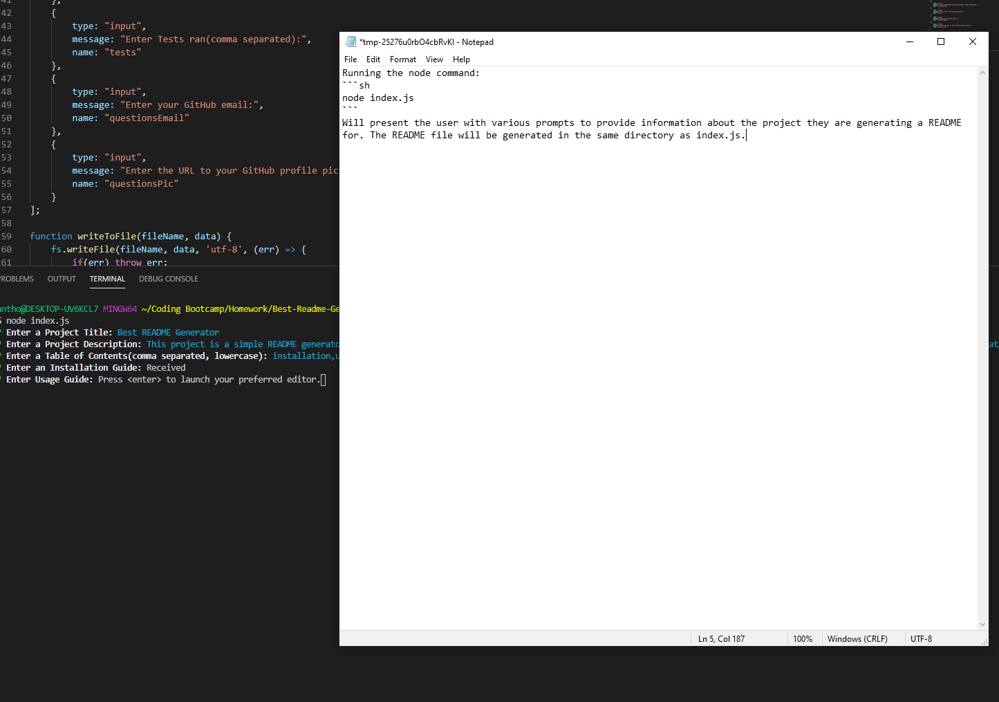
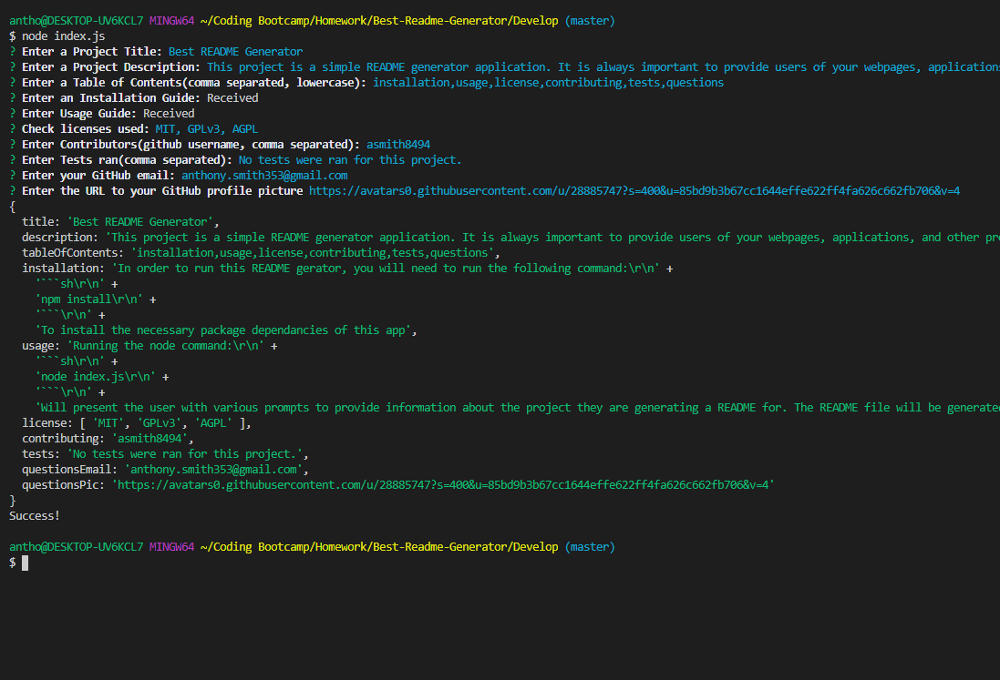

# Best README Generator


## Description
This project is a simple README generator application. It is always important to provide users of your webpages, applications, and other projects with a README that is informative, readable, and functional. This application aims to provide that by gaining information about your project and then generating a README file that is well formatted and easily readable.


## Table Of Contents
* [Installation](#installation)
* [Usage](#usage)
* [License](#license)
* [Contributing](#contributing)
* [Tests](#tests)
* [Questions](#questions)

## Installation
In order to run this README gerator, you will need to run the following command:
```sh
npm install
```
To install the necessary package dependancies of this app


## Usage
Running the node command:
```sh
node index.js
```
Will present the user with various prompts to provide information about the project they are generating a README for. The README file will be generated in the same directory as index.js.


## License

* [](https://github.com/tterb/atomic-design-ui/blob/master/LICENSEs)

* [](https://opensource.org/licenses/)

* [](http://www.gnu.org/licenses/agpl-3.0)

## Contributing

* [asmith8494](http://github.com/asmith8494)

## Test

* No tests were ran for this project.

## Questions

* Email: anthony.smith353@gmail.com

## Project/Code Screenshots and Explanation (***Added after generation - Not part of the README Generator***)

* This first screenshot shows the first prompts: Title, Description (long, goes off screen), Table of Contents. Then we get to the prompt of Installation. Here I had to use the editor as I was entering code snippits and needed newline characters inserted into the readme, input would not allow this without extra code to determine where \n instances were.


* This screenshot shows that inquirer opens a notepad (or default editor) and allows the user to enter as many lines of text that they want. Here I fill out the installtion guide, close, and the input is saved by inquirer.


* Again for Usage, I had to write a code snippet. In the background, you can see the prompt show that the previous entry was 'Received' showing that the input was entered correctly.


* Finally, with a few more prompts: licenses (checkbox), contributors, tests, GH email, and a link to an image, the app console logs to confirm all values were input, and then we see "Success!" showing the file was written to. This README was generated using the app.